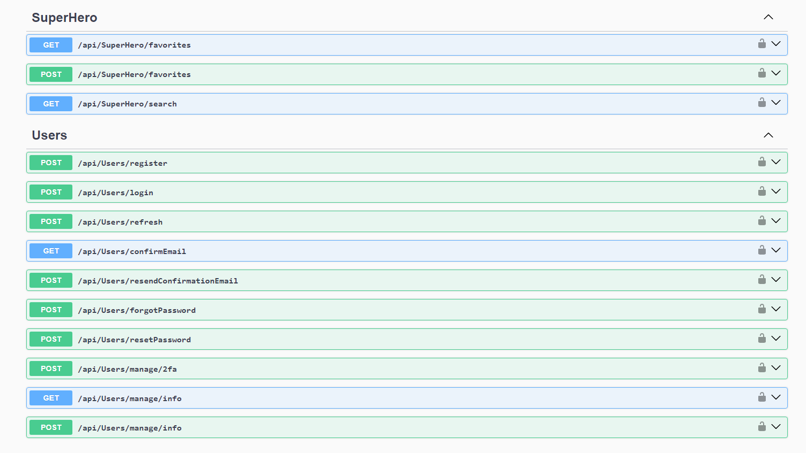

# SuperHeroApp

## Description

This project is RESTful API for searching and storing favorite superheroes, integrating with the Superhero API.

## Installation

- Clone the repository
- Navigate to the project directory.
- Run `dotnet build -tl` to build the solution.

## Usage

To run the web application:

```bash
cd .\src\Web\
dotnet watch run
```

### Swagger UI

After launching the solution, you can explore the available endpoints, specifications and shemas using Swagger UI. Simply navigate to the Swagger UI interface to interactively view and test the API endpoints.
- Local URL: [https://localhost:5001](https://localhost:5001)
- 


## Technologies Used
-   ASP.NET Core 8
-   Entity Framework Core 8
-   Swagger and OpenAPI
-   MediatR
-   AutoMapper
-   FluentValidation
-   NUnit, FluentAssertions, Moq & Respawn

## Architecture
This project follows clean architecture principles, emphasizing separation of concerns and modularity. It implements Domain-Driven Design (DDD) for domain 